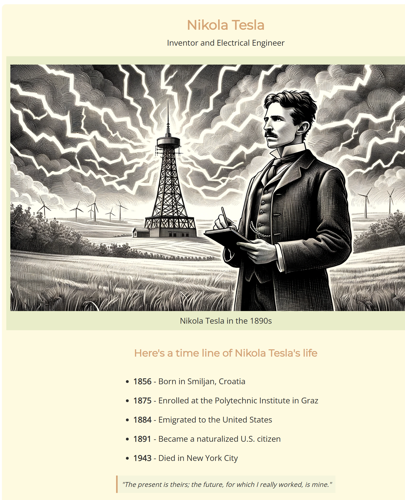

# Nikola Tesla Tribute Page

This is my first full HTML and CSS project. It’s a simple tribute page built as part of my web development learning path. The page presents a short timeline of Nikola Tesla’s life, his achievements, and a quote, styled using modern CSS practices.

## 📌 Features

- Responsive layout  
- Google Fonts integration  
- Flexbox-based alignment  
- Clean visual design  
- Timeline section and quote block  
- Footer with author credit

## 🛠 Technologies Used

- HTML5  
- CSS3  
- Google Fonts  
- Visual Studio Code

## 📁 Project Structure
📦 Nikola-Tesla-Tribute-Page
┣ 📄 index.html
┣ 📄 style.css
┣ 📄 nikola.png
┗ 📄 README.md

## 📷 Preview

## 🔗 Live Demo

Coming soon — GitHub Pages will be enabled.

## 🧠 What I Learned

- Structuring HTML semantically  
- Styling with custom fonts and color themes  
- Using Flexbox for layout  
- Image responsiveness with `max-width` and `object-fit`  
- Writing clean and maintainable code

## 👤 Author

Ahmed Tamer  
[GitHub](https://github.com/ahmedtamer50)  
[LinkedIn](www.linkedin.com/in/ahmed-tamer-ali)

